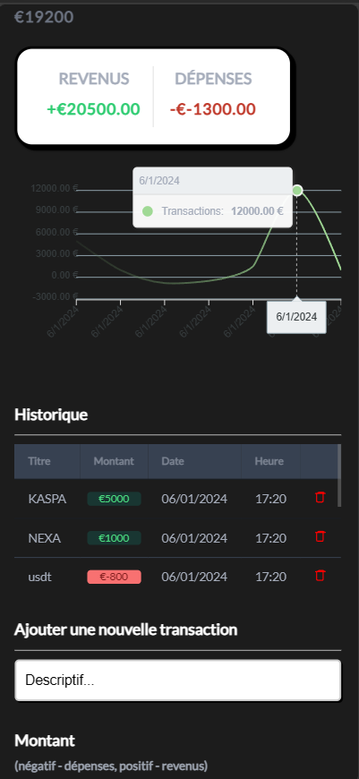

# V Expense Tracker




 


Vue Expense Tracker is a web and desktop application for personal expense tracking. Built with Vue.js and Tauri, it offers a smooth user experience and an intuitive interface for managing your personal financial transactions. It allows you to track income and expenses, displaying your current balance and a summary of your financial activities.

## Features

- Add and manage income and expense transactions.
- Display the total balance.
- Summary of financial activities.


## Run Locally

Clone the project

```bash
  git clone https://github.com/votre_nom_utilisateur/vue-expense-tracker.git
```

Go to the project directory

```bash
  cd my-project
```

Install dependencies

```bash
  npm install or yarn add
```

Start the server

```bash
  npm run start
```

